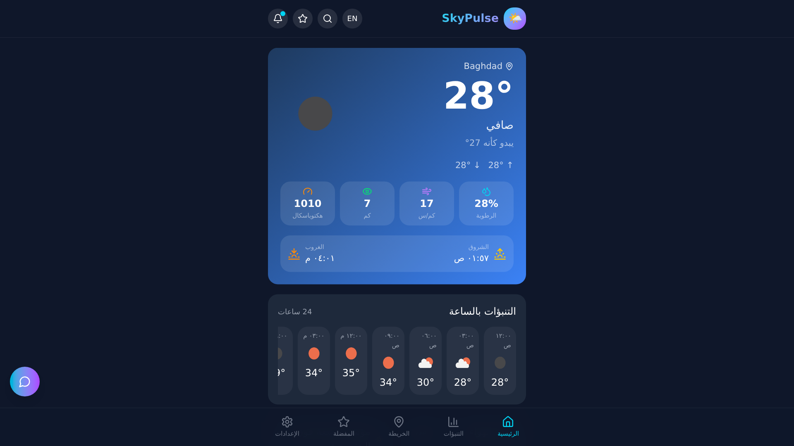

# 🌤️ تطبيق الطقس | Weather App

[](LICENSE.md)
[]()
[](https://weather-app-z-i-a-d.vercel.app)

> Professional weather web app with smart forecasts, bilingual UI & beautiful animations
> تطبيق ويب احترافي لمعرفة حالة الطقس بتحليلات طقس متقدمة



---

## 🌐 English

### Features

- 🌤️ **Accurate weather forecasts** — Precise and reliable climate forecasts
- 🤖 **Smart weather analysis** — Advanced and intelligent weather analysis
- 🌍 **Bilingual UI (Arabic/English)** — Interface in Arabic and English
- 📊 **Interactive charts & graphs** — Interactive charts and visualizations
- 🎨 **Smooth animations** — Smooth animations with Framer Motion
- 💬 **Smart weather assistant** — AI-powered weather assistant
- 📍 **Auto location detection** — Automatic location detection
- 🔔 **Weather alerts** — Weather alerts and notifications
- ⭐ **Favorites — save locations** — Save your favorite locations
- 📱 **Responsive design** — Works on all devices
- 🌙 **Dark/Light mode** — Choose your preferred theme

### Technologies

- Next.js, TypeScript, Tailwind CSS, shadcn/ui, Prisma, Framer Motion, Vercel

### Installation

```bash
git clone https://github.com/ziadamr45/Weather-App.git
cd Weather-App
npm install
# Set up .env from .env.example with weather API keys and configuration
npx prisma migrate dev
npm run dev
```

### Live Demo

[weather-app-z-i-a-d.vercel.app](https://weather-app-z-i-a-d.vercel.app)

### Contributing

See [CONTRIBUTING.md](CONTRIBUTING.md)

### License

This project uses [Source Available License](LICENSE.md) — © 2026 Ziad Amr

---

## 🇪🇬 العربية

### المميزات

- 🌤️ **توقعات طقس دقيقة** — توقعات مناخية دقيقة وموثوقة
- 🤖 **تحليلات طقس ذكية ومتقدمة** — تحليلات ذكية ومتقدمة للطقس
- 🌍 **ثنائي اللغة (عربي/إنجليزي)** — واجهة بالعربية والإنجليزية
- 📊 **رسوم بيانية تفاعلية** — مخططات ورسوم بيانية تفاعلية
- 🎨 **حركات وأنيميشن سلسة** — أنيميشن سلسة بـ Framer Motion
- 💬 **مساعد ذكي للطقس** — مساعد ذكي للطقس
- 📍 **تحديد الموقع التلقائي** — كشف الموقع تلقائيًا
- 🔔 **تنبيهات حالة الطقس** — تنبيهات وإشعارات حالة الطقس
- ⭐ **المفضلة — حفظ المواقع** — احفظ مواقعك المفضلة
- 📱 **تصميم متجاوب** — يعمل على جميع الأجهزة
- 🌙 **وضع داكن/فاتح** — اختر المظهر المناسب لك

### التقنيات

- Next.js، TypeScript، Tailwind CSS، shadcn/ui، Prisma، Framer Motion، Vercel

### التثبيت

```bash
git clone https://github.com/ziadamr45/Weather-App.git
cd Weather-App
npm install
# إعداد .env من .env.example بمفاتيح API والإعدادات
npx prisma migrate dev
npm run dev
```

### تجربة مباشرة

[weather-app-z-i-a-d.vercel.app](https://weather-app-z-i-a-d.vercel.app)

### المساهمة

راجع [CONTRIBUTING.md](CONTRIBUTING.md)

### الرخصة

هذا المشروع يستخدم [رخصة عرض المصدر](LICENSE.md) — © 2026 زياد عمرو

---

## Developer | المطور

**Ziad Amr** (زياد عمرو)

- 🌐 Portfolio: [ziadamrme.vercel.app](https://ziadamrme.vercel.app)
- 💼 GitHub: [github.com/ziadamr45](https://github.com/ziadamr45)
- 📘 Facebook: [facebook.com/ziad7mr](https://www.facebook.com/ziad7mr)
- 💬 Telegram: [t.me/ziadamr](https://t.me/ziadamr)
- 📸 Instagram: [instagram.com/ziadamr455](https://www.instagram.com/ziadamr455/)
- 🧵 Threads: [threads.com/@ziadamr455](https://www.threads.com/@ziadamr455)
- 🐦 X (Twitter): [x.com/ziad90216](https://x.com/ziad90216)
- 🎥 YouTube: [youtube.com/@alhayat_ala_eltarek](https://youtube.com/@alhayat_ala_eltarek)
- 💼 LinkedIn: [linkedin.com/in/ziad-amr-44633a411](https://www.linkedin.com/in/ziad-amr-44633a411)
- 📧 Email: ziad90216@gmail.com

---
<p align="center">
  Powered by <a href="https://github.com/ziadamr45">Ziad Amr</a>
</p>
